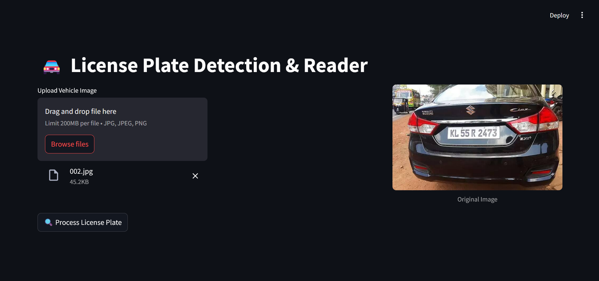
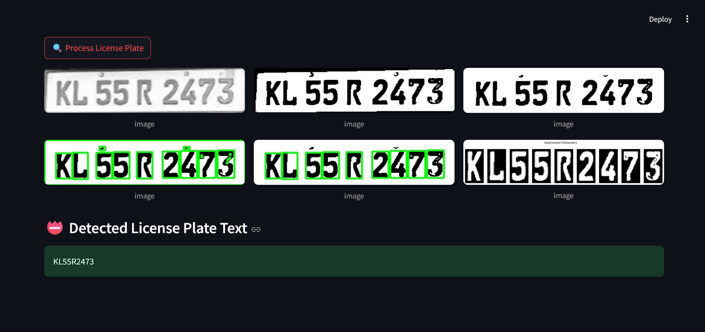
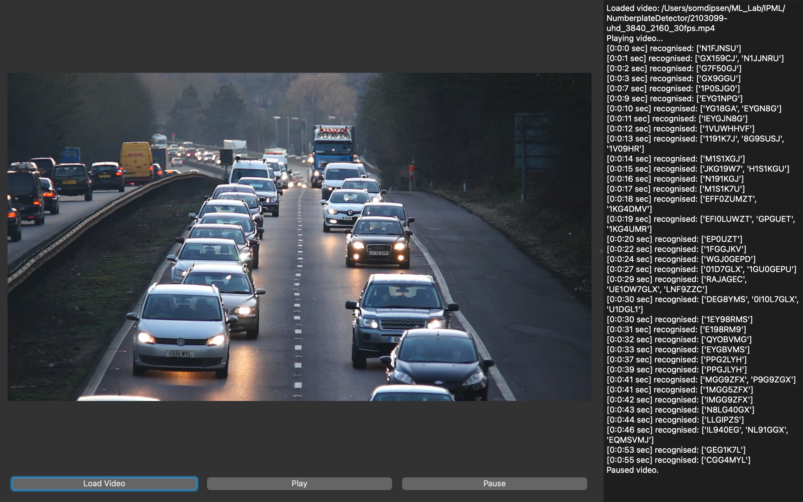

# 📷 Smart License Plate Recognition

A course project focused on detecting vehicle number plates using YOLOv11/Haar cascade, extracting characters using classical image processing techniques, and recognizing characters via a custom Convolutional Neural Network (CNN).

## 📁 Project Structure
 ```
 smart-license-plate-recognition/
 ├── BaseGUIFile.py             # Main PyQt5 GUI application
 ├── model.h5                   # Trained CNN model for OCR
 ├── haarcascade_indian.xml     # Haar cascade for number plate detection
 ├── results/                   # Output screenshots and results
 ├── README.md                  # Project documentation
 ├── requirements.txt           # Python dependencies
 └── …
 ```

## 🚀 Features

- **Real-time number plate detection** using YOLOv11 object detection.
- **Character segmentation** using image processing techniques (grayscale, thresholding, contour detection, etc.).
- **Character recognition** powered by a custom-trained CNN model.
- GUI implemented using PyQt5 for interactive visualization and control.
- Modular and easy-to-extend architecture.
- Suitable for smart surveillance, parking systems, and traffic monitoring.

## 🖥️ GUI Demonstration

Our PyQt5-based GUI supports video-based inference with frame-wise recognition logs and real-time result display. Users can load a video(For this sample project)/connect it to a live videofeed, play, and pause the recognition process interactively. The detected numberplates would be shown to the right. There might be multiple different entries for a plate but it can be considered as different possibility for that plate prediction. 


## 📷 Sample Results




## 🧪 How to Run
1. Clone the repository
```bash
    git clone https://github.com/rohitrrg/smart-license-plate-recognition.git
    cd smart-number-plate-recognition
```
2. (if required) create a virtual environment
```bash
    python -m venv venv
    source venv/bin/activate  # On Windows: venv\Scripts\activate
```

3. Install Dependencies
```bash
    pip install -r requirements.txt
```

4. Run
- a. Run the image recognition application
``` bash
    streamlit run app.py
```
- b. Run the video frame recognition application
``` bash
    python GUI_Demo.py
```


## Dataset Used
* Yolov11 Object Detection: [License plate Detection - RoboFlow](https://universe.roboflow.com/roboflow-universe-projects/license-plate-recognition-rxg4e/dataset/11)
* CNN Classification: [Kaggle](https://www.kaggle.com/datasets/sarthakvajpayee/ai-indian-license-plate-recognition-data)

## 🧠 Model Training

The CNN model used for character recognition is trained on the Kaggle Indian License Plate dataset. The final trained model `./saved_model/license_plate_model.h5` is included for direct inference.

> To retrain: See `training.ipynb` under heading `Train Liscnece plate Characters classification CNN Model`

## 📚 References
* [YOLOv11 GitHub Repository](https://github.com/ultralytics/ultralytics)
* [OpenCV Documentation](https://docs.opencv.org/)
* [Keras Documentation](https://keras.io/)

## 🛠️ Known Issues / TODOs
- Improve detection accuracy under poor lighting
- Add multi-language OCR support
- Optimize inference time on CPU
- Package as Docker container

## 🌐 Deployment (Optional)

Containerization and edge deployment instructions coming soon (Jetson Nano, Docker, etc.)